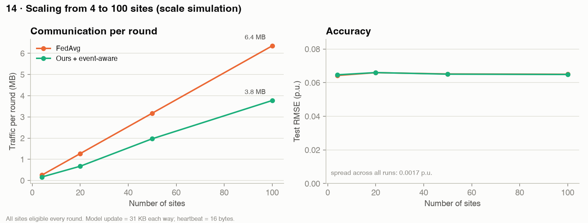

# GridMesh — measured results

Auto-generated by `run_experiments.py` (`python -m src.evaluation.report` to rebuild).
5 seeds (42, 43, 44, 45, 46), 4 sites, test = daytime
intervals of the last 15% of days in every month, errors in p.u. of installed capacity
(0.05 = 5% of capacity). Mean ± std over seeds.

**What is real and what is simulated:** weather/irradiance REAL · PV power MODELED from real
irradiance · sites and faults SIMULATED · demand SYNTHETIC · costs ASSUMED.
Raw data stays at each site; no secure aggregation or differential privacy is implemented.

## 1. Forecasting (no faults)
| Method | RMSE | MAE | Worst-site RMSE | Comm. (MB) | Fault damage (%) | Dropout degradation (%) |
|---|---|---|---|---|---|---|
| Persistence | 0.0908 ± 0.0015 | 0.0673 ± 0.0011 | 0.0941 ± 0.0016 | – | – | – |
| Smart persistence | 0.0735 ± 0.0011 | 0.0362 ± 0.0007 | 0.0761 ± 0.0013 | – | – | – |
| Local-only | 0.0666 ± 0.0025 | 0.0386 ± 0.0034 | 0.0712 ± 0.0049 | – | – | – |
| Centralized (pooled data) | 0.0643 ± 0.0008 | 0.0367 ± 0.0012 | 0.0667 ± 0.0015 | – | – | – |
| FedAvg | 0.0642 ± 0.0013 | 0.0360 ± 0.0015 | 0.0666 ± 0.0016 | 5.08 | 2.4 ± 3.7 | 0.5 ± 0.8 |
| **Reliability-aware FedAvg (ours)** | 0.0641 ± 0.0013 | 0.0366 ± 0.0019 | 0.0666 ± 0.0017 | 5.08 | 0.1 ± 0.9 | 0.1 ± 0.8 |
| **Ours + event-aware participation** | 0.0648 ± 0.0013 | 0.0372 ± 0.0013 | 0.0669 ± 0.0013 | 2.55 | -0.1 ± 1.8 | -0.5 ± 1.8 |

*Fault damage* = healthy-site RMSE increase vs. the same sites without faults, averaged over all
fault scenarios. *Dropout degradation* = RMSE increase vs. no dropout, averaged over dropout rates.

## 2. Faulty-client scenarios — healthy-site RMSE increase (%)
| Scenario | FedAvg | Reliability-aware FedAvg (ours) | Ours + event-aware participation | Ours beats FedAvg (runs) |
|---|---|---|---|---|
| bias D | -0.4 ± 0.5 | -0.4 ± 0.8 | 0.6 ± 0.6 | 2 / 5 |
| feature corruption D | -0.3 ± 0.8 | -0.0 ± 1.1 | 0.7 ± 1.0 | 2 / 5 |
| stale CD | 8.9 ± 4.4 | 0.4 ± 0.9 | -0.3 ± 1.9 | 5 / 5 |
| stale D | 3.3 ± 2.2 | 0.0 ± 0.5 | -0.7 ± 1.8 | 5 / 5 |
| target noise CD | 1.4 ± 0.8 | 0.7 ± 1.1 | -0.1 ± 3.0 | 4 / 5 |
| target noise D | 1.7 ± 0.4 | 0.2 ± 0.6 | -0.7 ± 2.2 | 5 / 5 |

Faults are simulated sensor/meter problems present for the whole training run
(`D` = one site of 4, `CD` = two sites of 4).

Reliability-aware FedAvg (ours): lower healthy-site RMSE than FedAvg in **23 of 30** fault runs (scenario × seed).

Ours + event-aware participation: lower healthy-site RMSE than FedAvg in **16 of 30** fault runs (scenario × seed).

## 3. Fault severity sweep — healthy-site RMSE (stale sensor on site D)
| Severity | FedAvg | Reliability-aware FedAvg (ours) |
|---|---|---|
| 0.0 | 0.0642 | 0.0641 |
| 0.5 | 0.0642 | 0.0638 |
| 1.0 | 0.066 | 0.0639 |
| 2.0 | 0.0666 | 0.0639 |
| 4.0 | 0.0656 | 0.064 |

## 4. Client dropout — test RMSE
| Dropout rate | FedAvg | Reliability-aware FedAvg (ours) | Ours + event-aware participation |
|---|---|---|---|
| 0.0 | 0.0642 | 0.0641 | 0.0648 |
| 0.25 | 0.0644 | 0.0641 | 0.0645 |
| 0.5 | 0.0646 | 0.0643 | 0.0646 |

## 5. Reserve at one aggregation node (forecasts: Reliability-aware FedAvg (ours))
| Policy | Reserve (% of forecast) | Not served (% of demand) | Reserve (MWh) | Not served (MWh) | Intervals covered (%) | Target (%) | Total cost |
|---|---|---|---|---|---|---|---|
| Fixed 20% | 20.0 ± 0.0 | 0.76 ± 0.03 | 1995 | 185 | 87.4 | – | 5689 |
| n-sigma δ=0.02 | 25.7 ± 0.7 | 0.46 ± 0.01 | 2577 | 112 | 93.7 | 98 | 4820 |
| n-sigma δ=0.05 | 20.5 ± 0.7 | 0.58 ± 0.02 | 2057 | 141 | 91.8 | 95 | 4880 |
| n-sigma δ=0.1 | 15.9 ± 0.7 | 0.73 ± 0.02 | 1596 | 176 | 89.1 | 90 | 5114 |

n-sigma reserve: `r = max(α·σ_e − μ_e, 0)`, `α = Φ⁻¹(1−δ)`, causal 6-hour rolling error statistics
(inspired by Khaing, Kannan & Rao, *Clean Energy* 2026). Costs: 1 unit
per MWh of reserve, 20 units per MWh not served — **simulation
assumptions**. Demand is **synthetic**.

## 6. Scaling 4 → 100 sites (scale simulation, 1 seed, 5 rounds)
| Sites | Method | MB per round | Participation (%) | Test RMSE |
|---|---|---|---|---|
| 4 | FedAvg | 0.25 | 100 | 0.0643 |
| 4 | Ours + event-aware participation | 0.17 | 65 | 0.0647 |
| 20 | FedAvg | 1.27 | 100 | 0.0659 |
| 20 | Ours + event-aware participation | 0.67 | 53 | 0.066 |
| 50 | FedAvg | 3.18 | 100 | 0.0652 |
| 50 | Ours + event-aware participation | 1.97 | 62 | 0.0651 |
| 100 | FedAvg | 6.35 | 100 | 0.065 |
| 100 | Ours + event-aware participation | 3.77 | 59 | 0.0649 |

## Plots

