# GridMesh — measured results

Auto-generated by `run_experiments.py` (`python -m src.evaluation.report` to rebuild).
3 seeds (42, 43, 44), 4 sites, test = daytime
intervals of the last 15% of days in every month, errors in p.u. of installed capacity
(0.05 = 5% of capacity). Mean ± std over seeds.

**What is real and what is simulated:** weather/irradiance REAL · PV power MODELED from real
irradiance · sites and faults SIMULATED · demand SYNTHETIC · costs ASSUMED.
Raw data stays at each site; no secure aggregation or differential privacy is implemented.

## 1. Forecasting (no faults)
| Method | RMSE | MAE | Worst-site RMSE | Comm. (MB) | Fault damage (%) | Dropout degradation (%) |
|---|---|---|---|---|---|---|
| Persistence | 0.0910 ± 0.0019 | 0.0675 ± 0.0013 | 0.0948 ± 0.0014 | – | – | – |
| Smart persistence | 0.0737 ± 0.0013 | 0.0363 ± 0.0006 | 0.0767 ± 0.0012 | – | – | – |
| Local-only | 0.0670 ± 0.0017 | 0.0382 ± 0.0024 | 0.0726 ± 0.0047 | – | – | – |
| Centralized (pooled data) | 0.0646 ± 0.0006 | 0.0369 ± 0.0016 | 0.0673 ± 0.0015 | – | – | – |
| FedAvg | 0.0643 ± 0.0012 | 0.0358 ± 0.0006 | 0.0669 ± 0.0016 | 5.08 | 2.6 ± 3.6 | 0.4 ± 0.9 |
| **Reliability-aware FedAvg (ours)** | 0.0641 ± 0.0011 | 0.0364 ± 0.0008 | 0.0669 ± 0.0017 | 5.08 | 0.4 ± 0.8 | 0.4 ± 0.4 |
| **Ours + event-aware participation** | 0.0648 ± 0.0011 | 0.0362 ± 0.0010 | 0.0678 ± 0.0019 | 2.80 | 0.0 ± 1.3 | 0.2 ± 1.2 |

*Fault damage* = healthy-site RMSE increase vs. the same sites without faults, averaged over all
fault scenarios. *Dropout degradation* = RMSE increase vs. no dropout, averaged over dropout rates.

## 2. Faulty-client scenarios — healthy-site RMSE increase (%)
| Scenario | FedAvg | Reliability-aware FedAvg (ours) | Ours + event-aware participation |
|---|---|---|---|
| bias D | -0.3 ± 0.6 | -0.1 ± 0.2 | 0.7 ± 0.6 |
| feature corruption D | -0.3 ± 0.6 | 0.4 ± 1.2 | -0.7 ± 0.8 |
| stale CD | 9.2 ± 2.0 | 0.5 ± 0.7 | -0.4 ± 1.3 |
| stale D | 3.3 ± 3.0 | 0.2 ± 0.1 | -0.6 ± 0.4 |
| target noise CD | 1.5 ± 0.8 | 0.7 ± 1.4 | 1.7 ± 2.0 |
| target noise D | 2.0 ± 0.2 | 0.3 ± 0.3 | -0.5 ± 0.3 |

Faults are simulated sensor/meter problems present for the whole training run
(`D` = one site of 4, `CD` = two sites of 4).

## 3. Fault severity sweep — healthy-site RMSE (stale sensor on site D)
| Severity | FedAvg | Reliability-aware FedAvg (ours) |
|---|---|---|
| 0.0 | 0.0643 | 0.0641 |
| 0.5 | 0.0646 | 0.0639 |
| 1.0 | 0.0662 | 0.0641 |
| 2.0 | 0.067 | 0.0642 |
| 4.0 | 0.0661 | 0.0641 |

## 4. Client dropout — test RMSE
| Dropout rate | FedAvg | Reliability-aware FedAvg (ours) | Ours + event-aware participation |
|---|---|---|---|
| 0.0 | 0.0643 | 0.0641 | 0.0648 |
| 0.25 | 0.0643 | 0.0642 | 0.0646 |
| 0.5 | 0.0647 | 0.0644 | 0.0653 |

## 5. Reserve at one aggregation node (forecasts: Reliability-aware FedAvg (ours))
| Policy | Reserve (% of forecast) | Not served (% of demand) | Reserve (MWh) | Not served (MWh) | Intervals covered (%) | Target (%) | Total cost |
|---|---|---|---|---|---|---|---|
| Fixed 20% | 20.0 ± 0.0 | 0.76 ± 0.05 | 1899 | 176 | 87.6 | – | 5428 |
| n-sigma δ=0.02 | 25.6 ± 1.0 | 0.46 ± 0.02 | 2447 | 106 | 93.9 | 98 | 4568 |
| n-sigma δ=0.05 | 20.4 ± 1.0 | 0.58 ± 0.02 | 1953 | 133 | 91.9 | 95 | 4614 |
| n-sigma δ=0.1 | 15.8 ± 0.9 | 0.72 ± 0.03 | 1516 | 166 | 89.3 | 90 | 4839 |

n-sigma reserve: `r = max(α·σ_e − μ_e, 0)`, `α = Φ⁻¹(1−δ)`, causal 6-hour rolling error statistics
(inspired by Khaing, Kannan & Rao, *Clean Energy* 2026). Costs: 1 unit
per MWh of reserve, 20 units per MWh not served — **simulation
assumptions**. Demand is **synthetic**.

## Plots
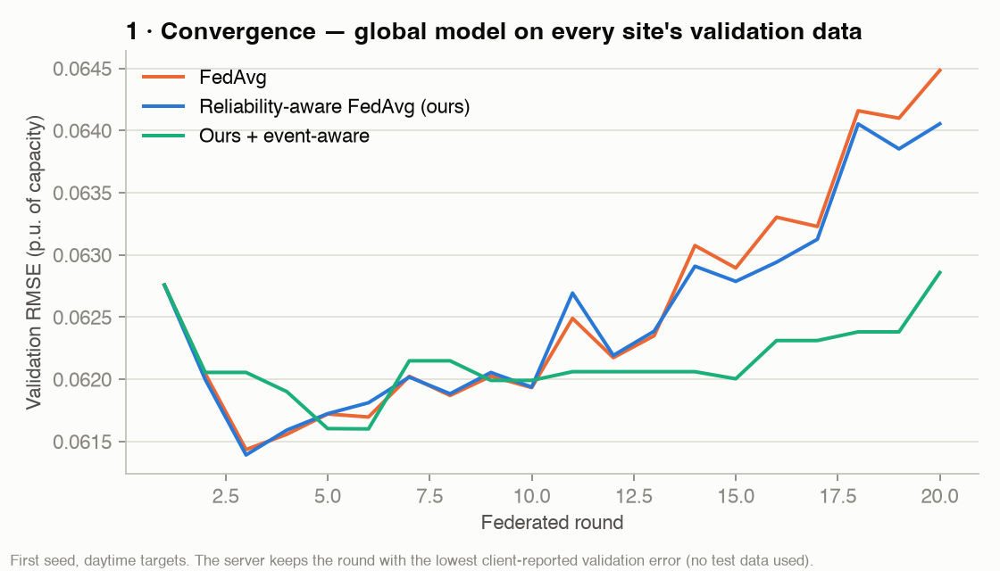
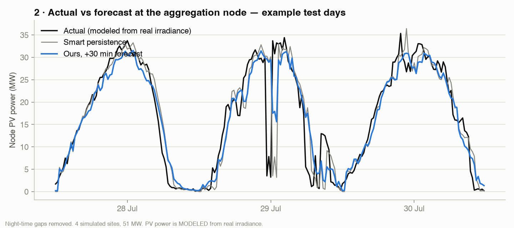
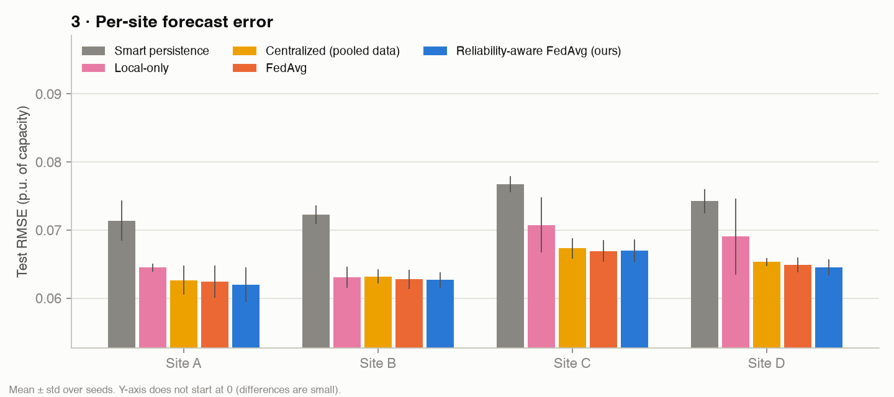
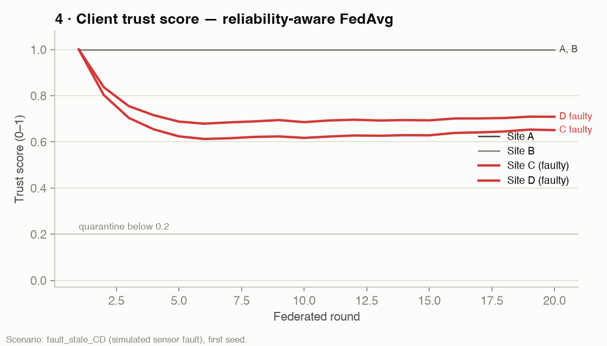
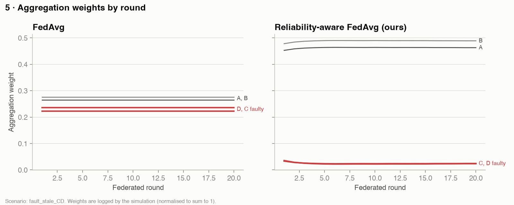
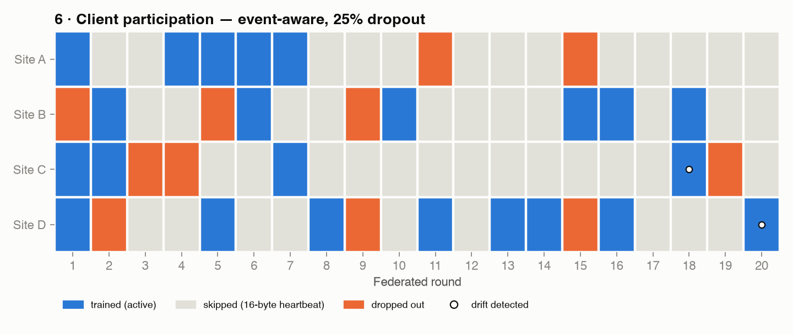
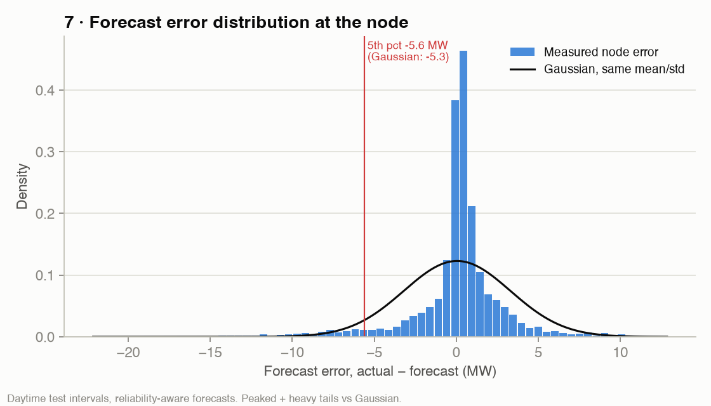
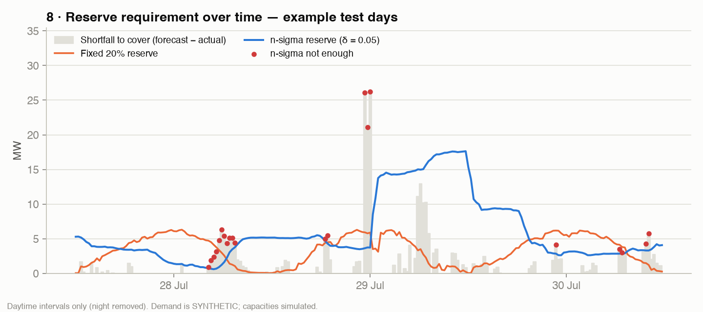
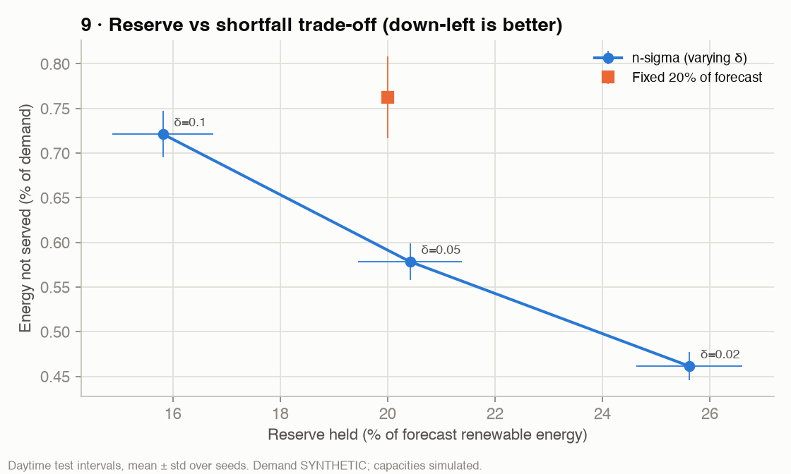
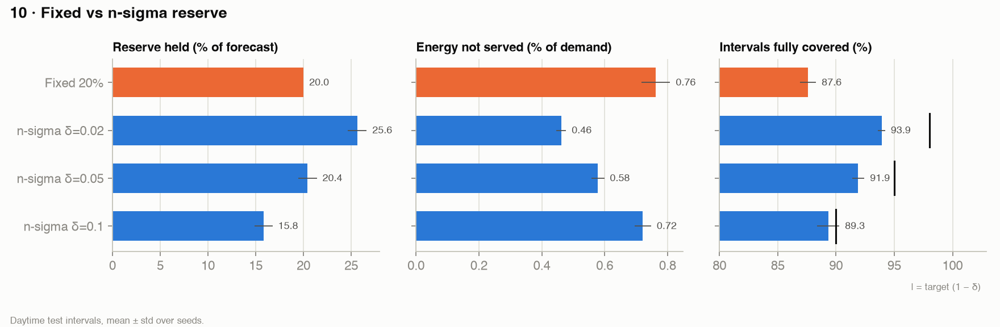
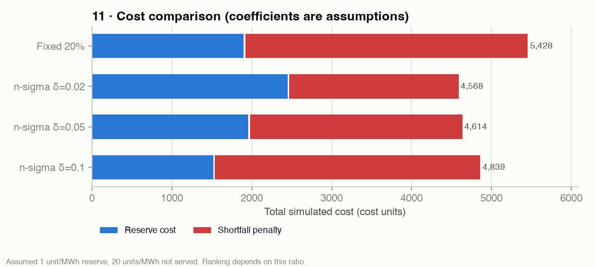
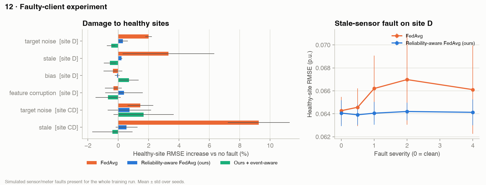
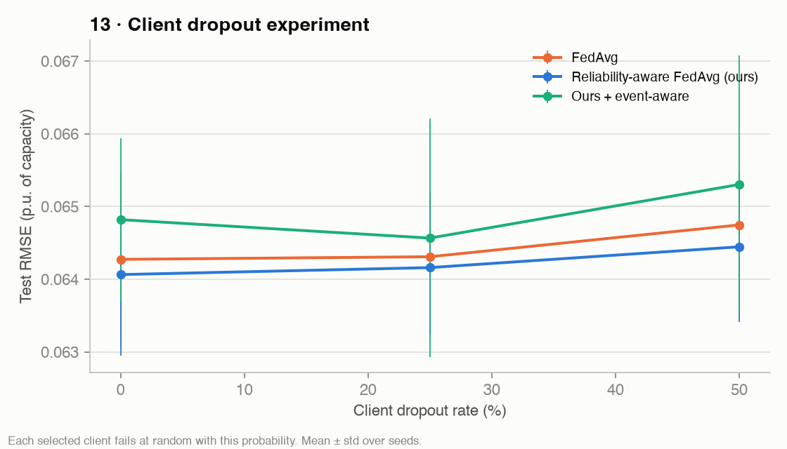
